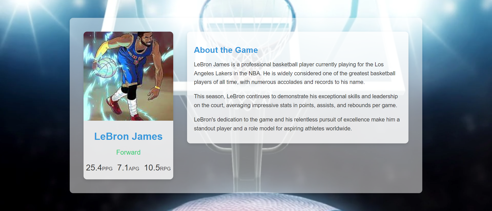

# Basketball Player Card

This is a simple React component to display information about a basketball player, including their name, image, position, and stats. Additionally, there's a section for extra content about the player and the game.



## Component_Structure

- **BasketballPlayerCard.js**: Contains the BasketballPlayerCard component.
- **BasketballPlayerCard.css**: Contains the CSS styling for the BasketballPlayerCard component.
- **AdditionalContent.js**: Contains the AdditionalContent component.
- **AdditionalContent.css**: Contains the CSS styling for the AdditionalContent component.
- **App.js**: Combines both components into a full-page layout.
- **App.css**: Contains the global CSS styling for the entire application.

## Props

The `BasketballPlayerCard` component accepts the following props:
- `name` (string): The player's name.
- `image` (string): URL to the player's image.
- `position` (string): The player's position.
- `stats` (object): An object containing the player's stats (e.g., { pointsPerGame: 25.4, assistsPerGame: 7.1, reboundsPerGame: 10.5 }).

## How to Run the Project

1. Clone the repository:
   ```bash
   git clone https://github.com/kvskmurty2802/Basketball-Player-profile.git
2. Navigate into the project directory:
   ```bash
    cd Basketball-Player-profile
3. Install dependencies:
   ```bash
    npm install
4. Run the project:
   ```bash
    npm run dev
## Feel free to explore these projects and contributions!

## Contact

GitHub Profile: [kvskmurty2802](http://github.com/kvskmurty2802/)

Contact me via [Email](mailto:krishnamurty2802@gmail.com).


## 💰 You can help me by Donating
[](https://buymeacoffee.com/kvskmurty2802) 
[](https://www.paypal.com/paypalme/kvskmurty2802/) 